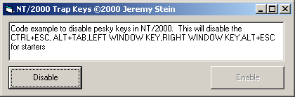



## NT/2000 Trap Keys

### Description

Trap system keys with a system keyboard hook on NT and 2000 OS.
 
### More Info
 

             |
---                |---
**Submitted On**   |2000-11-23 14:42:00
**By**             |[Jeremy Stein](https://github.com/Planet-Source-Code/PSCIndex/blob/master/ByAuthor/jeremy-stein.md)
**Level**          |Intermediate
**User Rating**    |4.8 (29 globes from 6 users)
**Compatibility**  |VB 6\.0
**Category**       |[Miscellaneous](https://github.com/Planet-Source-Code/PSCIndex/blob/master/ByCategory/miscellaneous__1-1.md)
**World**          |[Visual Basic](https://github.com/Planet-Source-Code/PSCIndex/blob/master/ByWorld/visual-basic.md)
**Archive File**   |[CODE\_UPLOAD1197611232000\.zip](https://github.com/Planet-Source-Code/jeremy-stein-nt-2000-trap-keys__1-13047/archive/master.zip)

